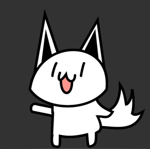

  
Virtual Pet
=============

To whom it may concern: all the images are stored in `assets/`  

In this project you will write a program using [Processing](https://processing.org) that displays any animal of your choosing. You can use almost any drawing functions that you would like, you can find the full list at the [Processing Reference](https://processing.org/reference) (See note below).  Your program will need to be divided into at least two functions `void setup()` and `void draw()`. You may find slides of the [apjavaProcessing slide presentation](https://docs.google.com/presentation/d/1sqbareaFmF9fMcp0XOl3hRO6hAlrU5WIaj4V-Kd3eDI/edit?usp=sharing) helpful. 

When you are happy with the appearance of your virtual pet, you will post your finished program on a website. You can get a free [GitHub](https://github.com) account for your website. Instructions on how to put your program on a GitHub website are on slides 73-86 of the [apjavaProcessing slide presentation](https://docs.google.com/presentation/d/1sqbareaFmF9fMcp0XOl3hRO6hAlrU5WIaj4V-Kd3eDI/edit?usp=sharing). Submit the link to your website on google classroom.

In the next assignment we will [use an Arduino to interact with your virtual pet](https://github.com/APCSLowell/LightSensorController#use-an-adafruit-circuit-playground-as-an-input-device-in-a-processing-program). As you work on your design, think about an element of the design that could be changed with a single variable.

Note: The following Processing functions do not work on the web:
----------------------------------------------------------
+ `circle()`
+ `square()`
+ `clear()`
+ `delay()`
+ `System.out.println()`
+ `System.out.print()`
+ `push()` and `pop()`
+ Using `CHORD` or `PIE` modes with `arc()`
+ Using an image as an argument in `background()`
+ Arduino code

My work so I don't have to type in the link
-----------------------
[Aiden P](https://AiP24.github.io/VirtualPet/)   
